# 📡 Wikipedia Real-Time Analytics with Azure Stream Analytics


> **Real-time Wikipedia changes tracking and analytics pipeline using Azure Cloud Services**

Bu proje, **Wikipedia RecentChange Stream** üzerinden gelen verilerin **Azure Event Hubs → Stream Analytics → Blob Storage** hattında işlenmesini göstermektedir. Wikipedia değişikliklerini gerçek zamanlı izleyerek kullanıcı türlerini (bot, anonymous, registered) ayırt eder ve sonuçları Azure Blob Storage'a kaydeder.

---

## 🏗️ Architecture Overview

```mermaid
graph LR
    A[📡 Wikipedia SSE Stream] --> B[🐍 Python Producer]
    B --> C[📨 Azure Event Hub]
    C --> D[⚡ Stream Analytics]
    D --> E[📦 Blob Storage]
    
    style A fill:#c0392b,stroke:#fff,color:#fff
    style B fill:#16a085,stroke:#fff,color:#fff
    style C fill:#2980b9,stroke:#fff,color:#fff
    style D fill:#27ae60,stroke:#fff,color:#fff
    style E fill:#d35400,stroke:#fff,color:#fff
```



## 🚀 Technologies Used

| Technology | Purpose | Version |
|------------|---------|---------|
| **Python** | SSE stream processing & Event Hub producer | 3.8+ |
| **Azure Event Hubs** | Message queuing & stream ingestion | Latest |
| **Azure Stream Analytics** | Real-time data processing & transformation | Latest |
| **Azure Blob Storage** | Output storage for processed data | Latest |
| **SSEClient** | Server-Sent Events handling | Latest |

---

## 📊 Data Flow Architecture


---

## 🛠️ Setup & Configuration

### Prerequisites
- Azure Subscription
- Python 3.8+
- Azure CLI

### 1️⃣ Azure Resources Setup

```bash
# Create Resource Group
az group create --name wikiAnalyticsRG --location westeurope

# Create Event Hub Namespace
az eventhubs namespace create \
  --name wikinamespace \
  --resource-group wikiAnalyticsRG \
  --location westeurope

# Create Event Hub
az eventhubs eventhub create \
  --name wikiEvents \
  --namespace-name wikinamespace \
  --resource-group wikiAnalyticsRG \
  --partition-count 2

# Create Storage Account
az storage account create \
  --name wikistorageacc \
  --resource-group wikiAnalyticsRG \
  --location westeurope \
  --sku Standard_LRS

# Create Blob Container
az storage container create \
  --name outputcontainer \
  --account-name wikistorageacc
```

### 2️⃣ Python Environment

```bash
pip install azure-eventhub sseclient-py requests
```

### 3️⃣ Stream Analytics Job Configuration

#### Input Configuration
- **Source Type**: Event Hub
- **Event Hub Name**: wikiEvents
- **Serialization**: JSON

#### Output Configuration
- **Sink Type**: Blob Storage
- **Container**: outputcontainer
- **Path Pattern**: wiki-changes/{date}/{time}
- **Format**: Line Separated JSON

---

## 🎯 Stream Analytics Query

```sql
SELECT
    title,
    [user],
    wiki,
    comment,
    timestamp,
    CASE
        WHEN isBot = true THEN 'bot'
        WHEN [user] IS NULL THEN 'anonymous'
        ELSE 'registered'
    END AS user_type
INTO
    outputblob
FROM
    inputhub
```

---

## 🔄 Data Processing Logic


---

## 🚀 Running the Application

### 1. Start Python Producer
```bash
python wiki_stream_producer.py
```

**Expected Output:**
```
📡 Wikipedia SSE akışına bağlanılıyor...
🚀 Gönderildi: Main Page
🚀 Gönderildi: User talk:Example
🚀 Gönderildi: Template:Citation needed
```

### 2. Start Stream Analytics Job
```bash
az stream-analytics job start \
  --resource-group wikiAnalyticsRG \
  --job-name wikiAnalyticsJob
```

### 3. Monitor Output
Check Azure Blob Storage container for processed JSON files:

```json
{
  "title": "Python (programming language)",
  "user": "WikiEditor123",
  "wiki": "enwiki",
  "comment": "Updated syntax examples",
  "timestamp": "2025-08-21T14:30:15Z",
  "user_type": "registered"
}
```

---

## 📈 Sample Analytics Queries

### User Activity Distribution
```sql
SELECT
    user_type,
    COUNT(*) as edit_count,
    COUNT(DISTINCT wiki) as wiki_count
FROM processed_data
GROUP BY user_type
```

### Most Active Wikis
```sql
SELECT TOP 10
    wiki,
    COUNT(*) as changes_count,
    COUNT(DISTINCT [user]) as unique_editors
FROM processed_data
WHERE user_type != 'bot'
GROUP BY wiki
ORDER BY changes_count DESC
```

---

## 🔍 Monitoring & Troubleshooting

### Key Metrics to Monitor
- **Event Hub Throughput**: Messages per second
- **Stream Analytics SU Usage**: Processing units utilization
- **Error Rate**: Failed events percentage
- **Latency**: End-to-end processing time

### Common Issues

| Issue | Solution |
|-------|----------|
| Connection timeouts | Check Event Hub connection string |
| JSON parsing errors | Validate Wikipedia event structure |
| High latency | Increase Stream Analytics SUs |
| Missing events | Check Event Hub retention settings |

---

## 🎯 Future Enhancements

- [ ] **Real-time Dashboard** with Power BI
- [ ] **Alert System** for suspicious activities
- [ ] **Machine Learning** integration for edit classification
- [ ] **Multi-language** support for different Wikipedia versions
- [ ] **Data Lake** integration for historical analysis

---

## 📁 Project Structure

```
wikipedia-analytics/
├── 📄 wiki_stream_producer.py    # Main producer script
└── 📄 README.md                  # This file
```

---

## 🤝 Contributing

1. Fork the repository
2. Create a feature branch (`git checkout -b feature/amazing-feature`)
3. Commit your changes (`git commit -m 'Add amazing feature'`)
4. Push to the branch (`git push origin feature/amazing-feature`)
5. Open a Pull Request

---


## 🙏 Acknowledgments

- **Wikimedia Foundation** for providing the real-time stream API
- **Microsoft Azure** for cloud infrastructure
- **Python Community** for excellent libraries

---

<div align="center">

## Geliştirici ##
**Fahri Can KÜMET [@cankumet](https://github.com/cankumet)**

</div>
